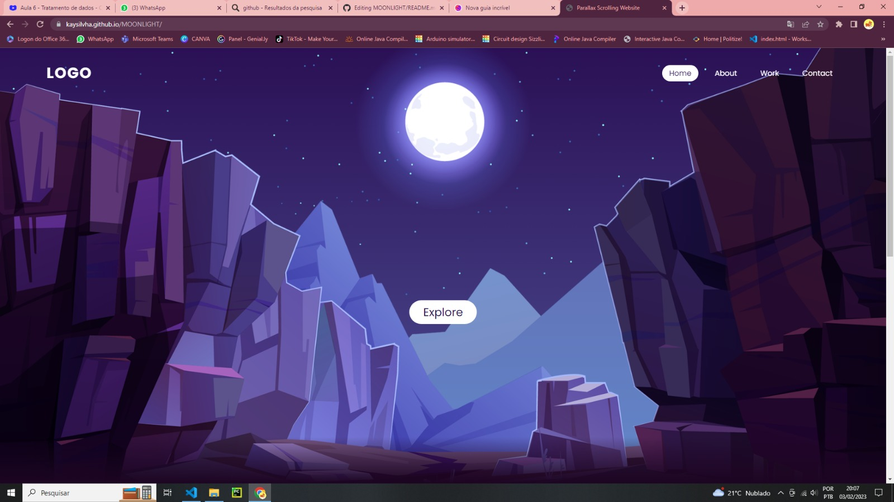

<h1 align="center"> ProjetoMoonlight </h1>

Esse foi apenas um projeto que eu capturei do youtube para praticar. Consiste em um site interativo simples, porém muiito bonito! 

  <a href="#-tecnologias">Tecnologias</a>&nbsp;&nbsp;&nbsp;|&nbsp;&nbsp;&nbsp;
  <a href="#-projeto">Projeto</a>&nbsp;&nbsp;&nbsp;|&nbsp;&nbsp;&nbsp;
  <a href="#-layout">Layout</a>&nbsp;&nbsp;&nbsp;|&nbsp;&nbsp;&nbsp;

 

  

## 🚀 Tecnologias

Esse projeto foi desenvolvido com as seguintes tecnologias:

- HTML e CSS
- JavaScript
- Git e Github

## 💻 Projeto

Um site legal e interativo.
- [Dê os créditos e, também, faça o projeto clicando aqui!](https://youtu.be/1wfeqDyMUx4)

## 🔖 Layout

Você pode visualizar o layout do projeto através [DESSE LINK](https://kaysilvha.github.io/MOONLIGHT/). 

